# ParseBench

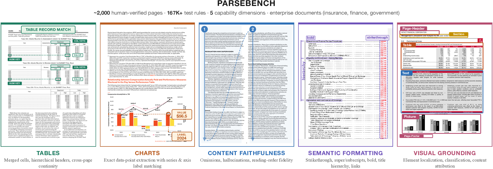

**Quick links:** [\[📜 Paper\]](https://arxiv.org/abs/2604.08538) [\[💻 Code\]](https://github.com/run-llama/ParseBench)

**ParseBench** is a benchmark for evaluating document parsing systems on real-world enterprise documents, with the following characteristics:

- **Multi-dimensional evaluation.** The benchmark is stratified into five capability dimensions — tables, charts, content faithfulness, semantic formatting, and visual grounding — each with task-specific metrics designed to capture what agentic workflows depend on.
- **Real-world enterprise documents.** The evaluation set contains ~2,000 human-verified pages from over 1,200 publicly available documents spanning insurance, finance, government, and other domains, ranging from straightforward to adversarially hard.
- **Dense test coverage.** Over 169K test rules across the five dimensions, providing fine-grained diagnostic power over precisely where a parser breaks down.
- **Human-verified annotations.** All annotations are produced through a two-pass pipeline: frontier VLM auto-labeling followed by targeted human correction.
- **Evaluation code suite.** The benchmark ships with a full evaluation framework supporting end-to-end pipeline evaluation, per-dimension scoring, and cross-pipeline comparison. The evaluation code can be found at [ParseBench](https://github.com/run-llama/ParseBench).

## Dataset Introduction

ParseBench comprises ~2,000 human-verified, annotated pages drawn from publicly available enterprise documents spanning insurance, finance, government, and other domains. The benchmark is stratified into five capability dimensions, each targeting a failure mode that consistently breaks production agentic workflows:

- **Tables.** Structural fidelity of merged cells and hierarchical headers. A single shifted header or merged-cell error causes an agent to extract values from the wrong column, silently corrupting financial analysis.
- **Charts.** Exact data point extraction with correct labels from bar, line, pie, and compound charts. Agents need precise numerical values rather than natural-language descriptions.
- **Content Faithfulness.** Omissions, hallucinations, and reading-order violations. Dropped or fabricated content means the agent acts on wrong context.
- **Semantic Formatting.** Preservation of inline formatting that carries meaning: strikethrough (marks superseded content), superscript/subscript (footnote references, chemical formulae), bold (defined terms, key values), titles, LaTeX, and code blocks.
- **Visual Grounding.** Tracing every extracted element back to its precise source location on the page. Required for auditability in regulated workflows.

| Dimension | Metric | Pages | Docs | Rules |
|-----------|--------|------:|-----:|------:|
| Tables | GTRM (GriTS + TableRecordMatch) | 503 | 284 | --- |
| Charts | ChartDataPointMatch | 568 | 99 | 4,864 |
| Content Faithfulness | Content Faithfulness Score | 506 | 506 | 141,322 |
| Semantic Formatting | Semantic Formatting Score | 476 | 476 | 5,997 |
| Layout (Visual Grounding) | Element Pass Rate | 500 | 321 | 16,325 |
| **Total (unique)** | | **2,078** | **1,211** | **169,011** |

Content Faithfulness and Semantic Formatting share the same 507 underlying text documents, evaluated with different rule sets. Totals reflect unique pages and documents. Tables uses a continuous metric (no discrete rules).

## Usage

You can use our [evaluation framework](https://github.com/run-llama/ParseBench) to run evaluations across the five dimensions:

- **Tables** — GTRM (average of GriTS and TableRecordMatch): GriTS measures structural similarity; TableRecordMatch treats tables as bags of records and scores structural fidelity
- **Charts** — ChartDataPointMatch: verifies annotated data points against the parser's table output
- **Content Faithfulness** — Rule-based detection of omissions, hallucinations, and reading-order violations at word, sentence, and digit granularities
- **Semantic Formatting** — Verification of formatting preservation (bold, strikethrough, superscript/subscript, titles, LaTeX, code blocks)
- **Visual Grounding** — Joint evaluation of localization (IoA), classification, and attribution

The evaluation dataset files include:

- [chart.jsonl](chart.jsonl) — 4,864 chart data point spot-check rules across 568 pages
- [table.jsonl](table.jsonl) — 503 ground-truth HTML tables for structural evaluation
- [text_content.jsonl](text_content.jsonl) — 141,322 content faithfulness rules (omission, hallucination, reading order) across 506 pages
- [text_formatting.jsonl](text_formatting.jsonl) — 5,997 formatting preservation rules across 476 pages
- [layout.jsonl](layout.jsonl) — 16,325 layout element and reading order rules across 500 pages
- [docs/](https://huggingface.co/datasets/llamaindex/ParseBench/tree/main/docs) — Source documents (PDF, JPG, PNG) organized by category

<details>
  <summary>Dataset Format</summary>

The dataset format is JSONL, with one line per test rule. The structure and field explanations:

```json
{
    "pdf": "docs/chart/report_p41.pdf",   // Relative path to the source document (PDF, JPG, or PNG)
    "category": "chart",                   // Evaluation category
    "id": "unique_rule_id",                // Unique identifier for this test rule
    "type": "chart_data_point",            // Rule type (see below)
    "rule": "{...}",                       // JSON-encoded rule payload with evaluation parameters
    "page": null,                          // Page number (1-indexed), used by layout rules
    "expected_markdown": null,             // Ground-truth HTML/markdown, used by table rules
    "tags": ["need_estimate"]              // Document-level tags for filtering and grouping
}
```

**Tags by category:**

- **chart**: `need_estimate` (value requires visual estimation), `3d_chart` (3D chart rendering)
- **table**: difficulty (`easy`, `hard`)
- **text_content / text_formatting**: difficulty (`easy`, `hard`) and document type (`dense`, `sparse`, `simple`, `multicolumns`, `ocr`, `multilang`, `misc`, `handwritting`)
- **layout**: difficulty (`easy`, `hard`)

**Rule types by category:**

- **chart**: `chart_data_point` — a spot-check data point specifying a numerical value and one or more labels (series name, x-axis category) that should be locatable in the parser's table output, with a configurable tolerance.
- **table**: `expected_markdown` — ground-truth HTML table structure. Evaluation treats tables as bags of records (rows keyed by column headers).
- **layout**: `layout` (bounding box + semantic class + content + reading order index), `order` (pairwise reading order assertion).
- **text_content**: `missing_word_percent`, `unexpected_word_percent`, `too_many_word_occurence_percent`, `missing_sentence_percent`, `unexpected_sentence_percent`, `too_many_sentence_occurence_percent`, `bag_of_digit_percent`, `order`, `missing_specific_word`, `missing_specific_sentence`, `is_footer`, `is_header`
- **text_formatting**: `is_bold`, `is_italic`, `is_underline`, `is_strikeout`, `is_mark`, `is_sup`, `is_sub`, `is_title`, `title_hierarchy_percent`, `is_latex`, `is_code_block`

</details>

<details>
  <summary>Evaluation Categories</summary>

**Chart** rule type — `chart_data_point`:

Each rule specifies an expected numerical value and one or more labels (series name, x-axis category, chart title). A data point is verified if its value and all associated labels can be located in the parser's table output. Evaluation is insensitive to table orientation (rows and columns can be swapped) and tolerant of numeric formatting differences (currency symbols, unit suffixes, thousands separators). Each data point includes a configurable tolerance since exact value retrieval from charts is often imprecise.

```
chart_data_point    # Spot-check data point: value + labels matched against parser's table output
                    # Rule fields: labels (list), value (string), max_diffs (int), normalize_numbers (bool)
```

**Table** — `expected_markdown`:

Each rule provides a ground-truth HTML table. Evaluation uses the **TableRecordMatch** metric, which treats a table as a bag of records: each row is a record whose cell values are keyed by their column headers. Ground-truth records are matched to predicted records, and each matched pair is scored by binary cell-level agreement. TableRecordMatch is insensitive to column and row order (which don't alter key-value relationships), while dropped or transposed headers cause large mismatches and are penalized accordingly.

```
expected_markdown   # Ground-truth HTML table for TableRecordMatch evaluation
                    # Rule fields: {} (ground truth stored in expected_markdown field)
```

**Text Content rule types** measure whether the parser faithfully reproduces textual content:

```
# Text correctness — omissions and hallucinations
missing_word_percent              # Fraction of ground-truth words missing from output
unexpected_word_percent           # Fraction of output words not in ground truth (hallucinations)
too_many_word_occurence_percent   # Excess word duplications
missing_sentence_percent          # Fraction of ground-truth sentences missing
unexpected_sentence_percent       # Fraction of output sentences not in ground truth
too_many_sentence_occurence_percent  # Excess sentence duplications
bag_of_digit_percent              # Digit frequency distribution match (catches OCR errors like 6→8)
missing_specific_word             # Binary: specific word present or absent
missing_specific_sentence         # Binary: specific sentence present or absent

# Structural
order                             # Pairwise reading order assertion (before/after)
is_footer                         # Footer detection
is_header                         # Header detection
```

**Text Formatting rule types** verify preservation of semantically meaningful formatting:

```
# Text styling
is_bold                   # Bold formatting preserved
is_italic                 # Italic formatting preserved
is_underline              # Underline formatting preserved
is_strikeout              # Strikethrough preserved (marks superseded content)
is_mark                   # Highlight/mark preserved
is_sup                    # Superscript preserved (footnotes, exponents)
is_sub                    # Subscript preserved (chemical formulae)

# Document structure
is_title                  # Text appears as heading at correct level
title_hierarchy_percent   # Title parent-child hierarchy score

# Special content
is_latex                  # Mathematical formula in LaTeX notation
is_code_block             # Fenced code block with language annotation
```

**Layout rule types** evaluate visual grounding:

```
layout    # Element annotation: bounding box (normalized [0,1]),
          # semantic class (Text, Table, Picture, Page-Header, Page-Footer),
          # content association, and reading order index
order     # Layout-level reading order assertion
```

</details>

<details>
  <summary>Document Categories</summary>

**Chart documents** (568 pages) — bar, line, pie, and compound charts from corporate reports, financial filings, and government publications. The dataset ensures diversity across charts with/without explicit value labels, discrete and continuous series, varying data density, and single vs. multi-chart pages.

**Table documents** (503 pages) — sourced primarily from insurance filings (SERFF), public financial documents, and government reports. Tables remain embedded in their original PDF pages, preserving the full visual context. The dataset includes merged cells, hierarchical headers, spanning rows, and multi-page tables.

**Text documents** (508 pages, shared by Content Faithfulness and Semantic Formatting) — one page per document, categorized by tag:

| Tag | Description | Docs |
|-----|-------------|-----:|
| `simple` | Simple text with some styling | 170 |
| `ocr` | Scanned/image documents, various quality | 119 |
| `multicolumns` | 1–8 columns, different layouts | 97 |
| `multilang` | 20+ languages, all major scripts | 47 |
| `misc` | Unusual content/layout/reading order | 33 |
| `dense` | Dense, large documents (e.g., newspapers) | 14 |
| `sparse` | Sparse text content, minimal text per page | 14 |
| `handwritting` | Significant handwritten text | 13 |

**Layout documents** (500 pages) — single-column, multi-column, and complex layouts with mixed media (text, images, tables, charts). Includes PDF, JPG, and PNG inputs. Evaluation uses a compact label set: Text, Table, Picture, Page-Header, and Page-Footer.

</details>

## Data Display

### Charts

<table>
  <tr>
    <td><a href="https://huggingface.co/datasets/llamaindex/ParseBench/blob/main/docs/chart/She-figures_p278.pdf">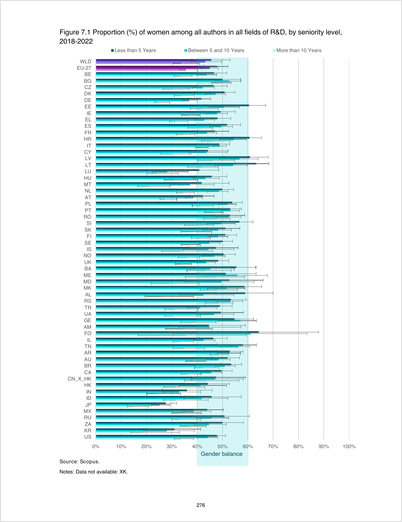</a></td>
    <td><a href="https://huggingface.co/datasets/llamaindex/ParseBench/blob/main/docs/chart/m-trends-2025-en_p41.pdf"></a></td>
    <td><a href="https://huggingface.co/datasets/llamaindex/ParseBench/blob/main/docs/chart/PRO013216_91_Blackrock_Proxy-Statement-2025_p112.pdf">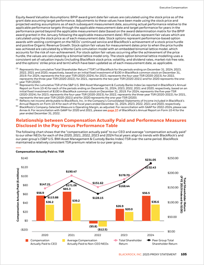</a></td>
    <td><a href="https://huggingface.co/datasets/llamaindex/ParseBench/blob/main/docs/chart/Whatnextfortheglobalcarindustry_p20.pdf">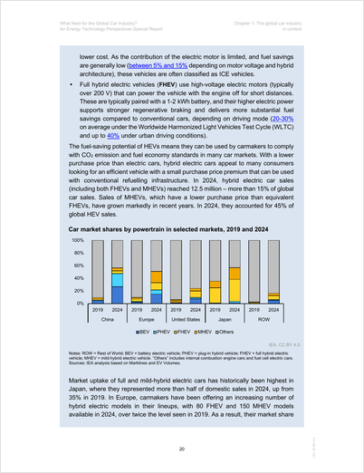</a></td>
    <td><a href="https://huggingface.co/datasets/llamaindex/ParseBench/blob/main/docs/chart/VPEG6_SIV_Information_Memorandum__June_2025__p20.pdf">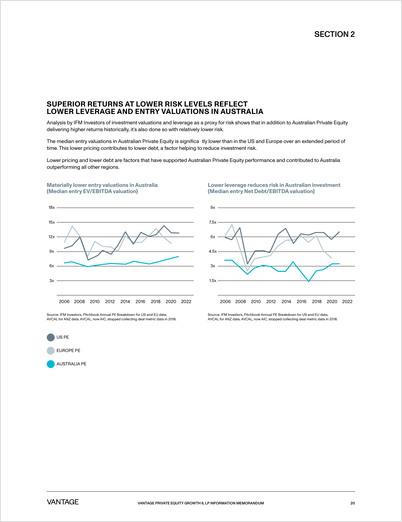</a></td>
    <td><a href="https://huggingface.co/datasets/llamaindex/ParseBench/blob/main/docs/chart/ac8b3538-en_p148.pdf">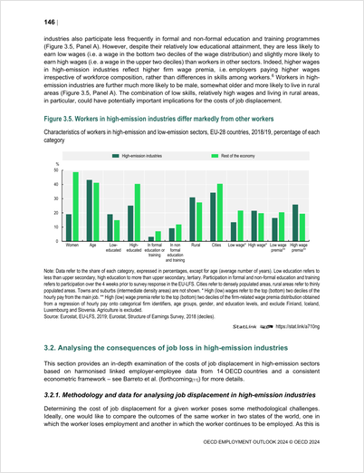</a></td>
  </tr>
</table>

### Tables

<table>
  <tr>
    <td><a href="https://huggingface.co/datasets/llamaindex/ParseBench/blob/main/docs/table/1653739079_page39.pdf">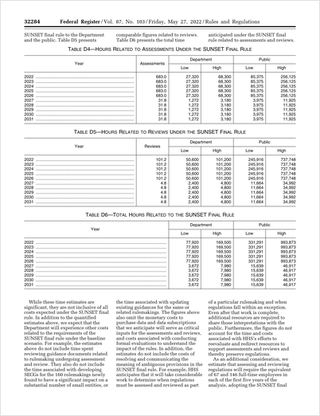</a></td>
    <td><a href="https://huggingface.co/datasets/llamaindex/ParseBench/blob/main/docs/table/222876fb_page2.pdf">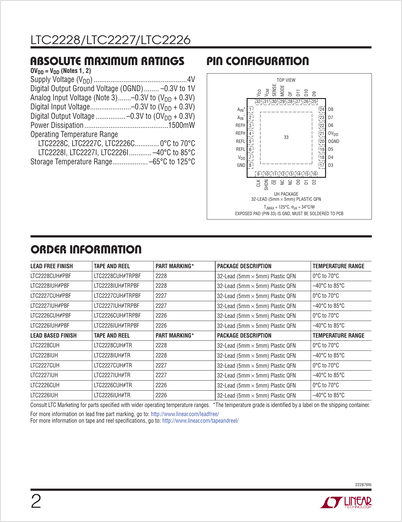</a></td>
    <td><a href="https://huggingface.co/datasets/llamaindex/ParseBench/blob/main/docs/table/JNPR.2018.page_212.pdf_110717_page1.pdf">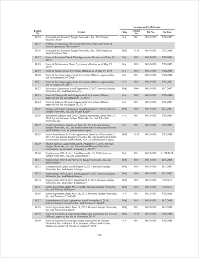</a></td>
    <td><a href="https://huggingface.co/datasets/llamaindex/ParseBench/blob/main/docs/table/SERFF_CA_random_pages 1_page687.pdf">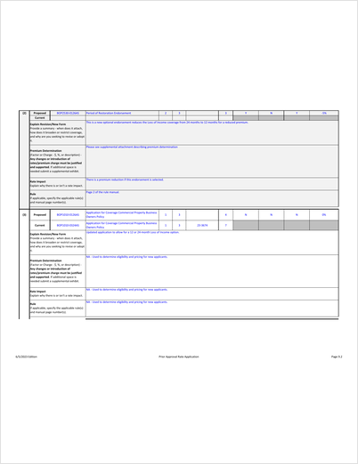</a></td>
    <td><a href="https://huggingface.co/datasets/llamaindex/ParseBench/blob/main/docs/table/FBLB-134215544_page44.pdf">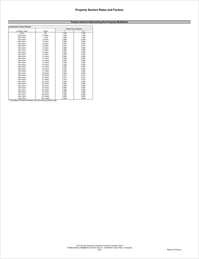</a></td>
    <td><a href="https://huggingface.co/datasets/llamaindex/ParseBench/blob/main/docs/table/SERFF_CA_random_pages 1_page1423.pdf">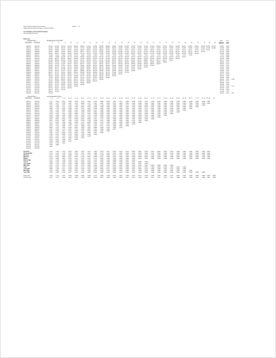</a></td>
  </tr>
</table>

### Layout & Visual Grounding

<table>
  <tr>
    <td><a href="https://huggingface.co/datasets/llamaindex/ParseBench/blob/main/docs/layout/2023-Sappi-Annual-Integrated-Report_Final-2_p2.pdf">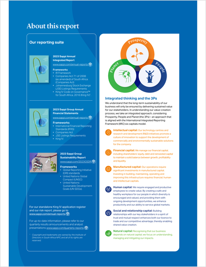</a></td>
    <td><a href="https://huggingface.co/datasets/llamaindex/ParseBench/blob/main/docs/layout/novartis-integrated-report-2021_p2.pdf">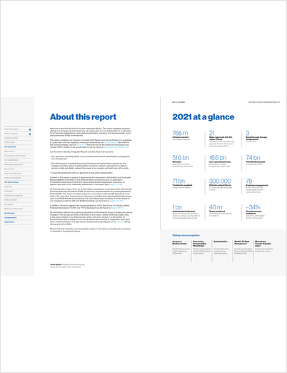</a></td>
    <td><a href="https://huggingface.co/datasets/llamaindex/ParseBench/blob/main/docs/layout/2024-Ford-Integrated-Sustainability-and-Financial-Report_Final_p46.pdf">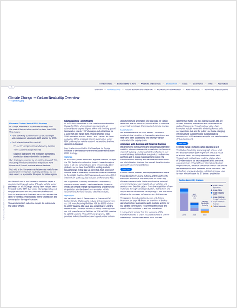</a></td>
    <td><a href="https://huggingface.co/datasets/llamaindex/ParseBench/blob/main/docs/layout/Intact-Financial-Corporation-2020-Annual-Report_p38.pdf">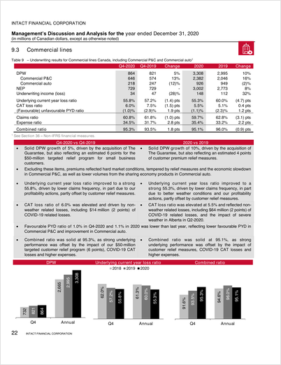</a></td>
    <td><a href="https://huggingface.co/datasets/llamaindex/ParseBench/blob/main/docs/layout/01205.jpg">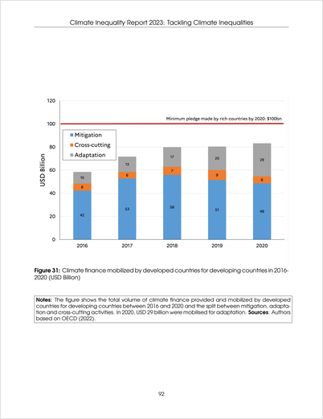</a></td>
    <td><a href="https://huggingface.co/datasets/llamaindex/ParseBench/blob/main/docs/layout/multi_col_40665.png">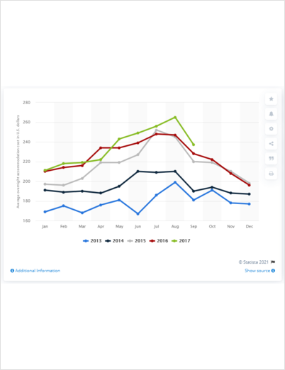</a></td>
  </tr>
</table>

### Text (Content Faithfulness & Semantic Formatting)

<table>
  <tr>
    <td><a href="https://huggingface.co/datasets/llamaindex/ParseBench/blob/main/docs/text/text_dense__canara.pdf">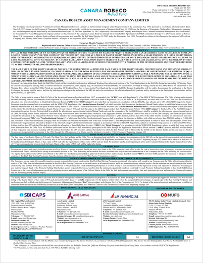</a></td>
    <td><a href="https://huggingface.co/datasets/llamaindex/ParseBench/blob/main/docs/text/text_handwritting__contract.pdf"></a></td>
    <td><a href="https://huggingface.co/datasets/llamaindex/ParseBench/blob/main/docs/text/text_multicolumns__10k2col.pdf">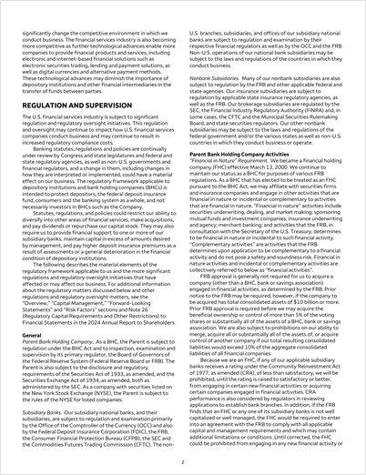</a></td>
    <td><a href="https://huggingface.co/datasets/llamaindex/ParseBench/blob/main/docs/text/text_multilang__arabic.pdf"></a></td>
    <td><a href="https://huggingface.co/datasets/llamaindex/ParseBench/blob/main/docs/text/text_ocr__012-25.pdf">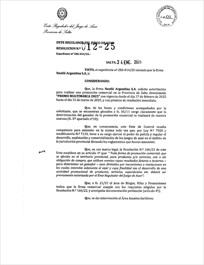</a></td>
    <td><a href="https://huggingface.co/datasets/llamaindex/ParseBench/blob/main/docs/text/text_simple__10k.pdf">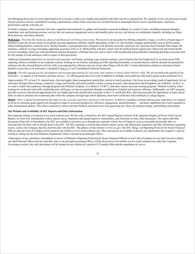</a></td>
  </tr>
</table>

## Copyright Statement

All documents are sourced from public online channels. The dataset is released under the [Apache 2.0 License](https://www.apache.org/licenses/LICENSE-2.0). If there are any copyright concerns, please contact us via the GitHub repository.

## Citation

```bibtex
@misc{zhang2026parsebench,
  title={ParseBench: A Document Parsing Benchmark for AI Agents},
  author={Boyang Zhang and Sebastián G. Acosta and Preston Carlson and Sacha Bron and Pierre-Loïc Doulcet and Simon Suo},
  year={2026},
  eprint={2604.08538},
  archivePrefix={arXiv},
  primaryClass={cs.CV},
  url={https://arxiv.org/abs/2604.08538},
}
```

## Links

- **Paper**: [arXiv:2604.08538](https://arxiv.org/abs/2604.08538)
- **GitHub**: [run-llama/ParseBench](https://github.com/run-llama/ParseBench)
- **HuggingFace Dataset**: [llamaindex/ParseBench](https://huggingface.co/datasets/llamaindex/ParseBench)

